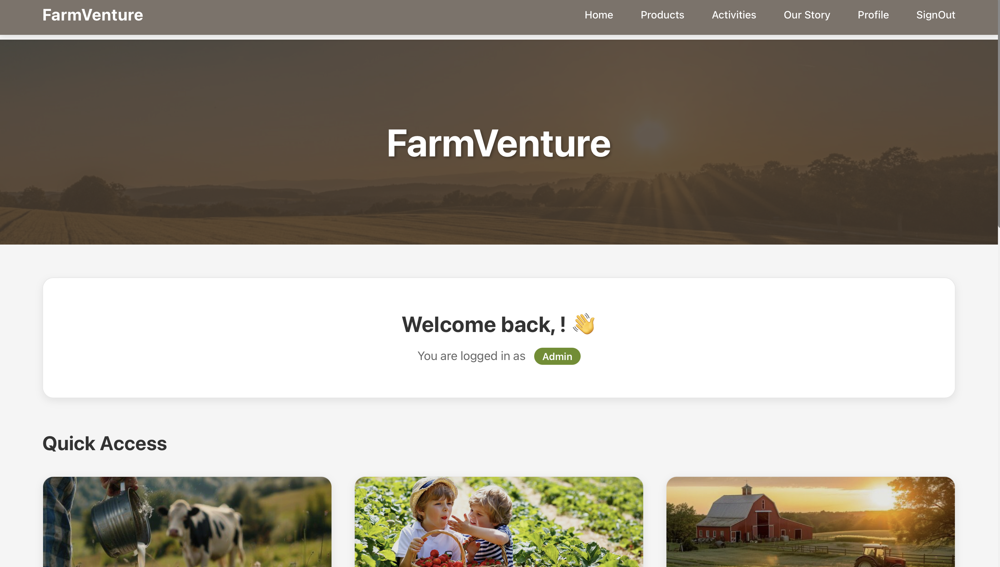
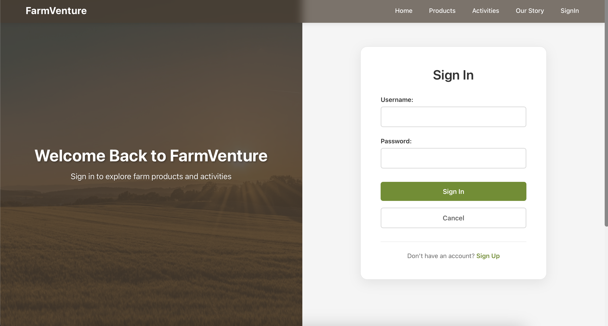
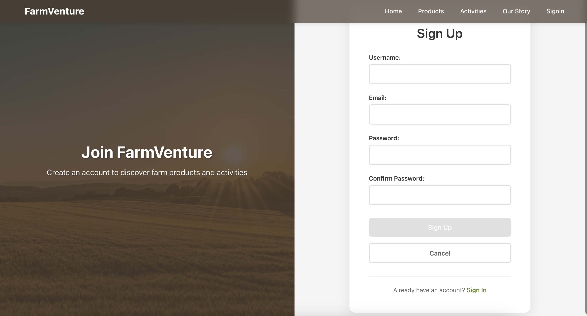
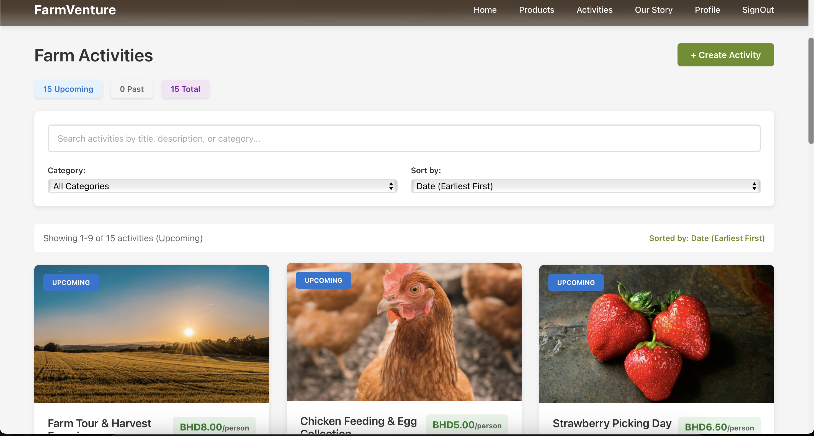
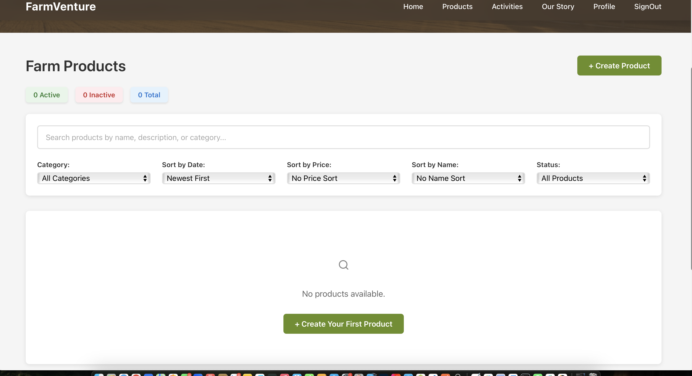
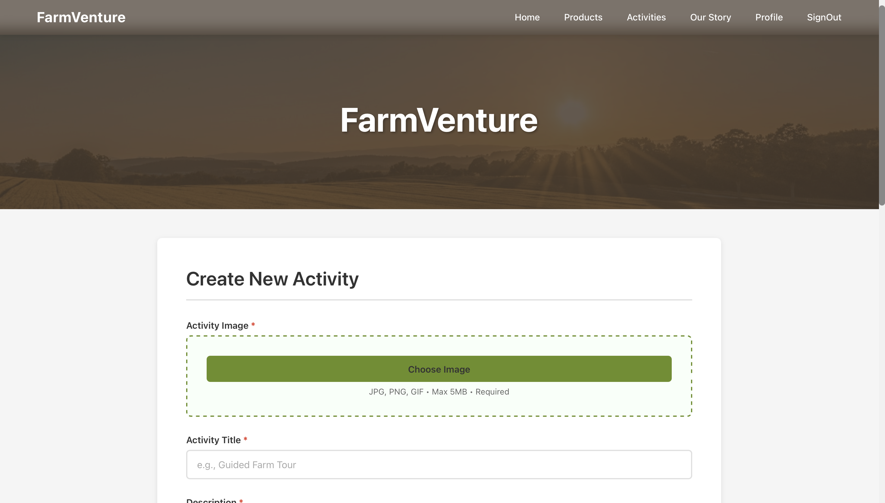
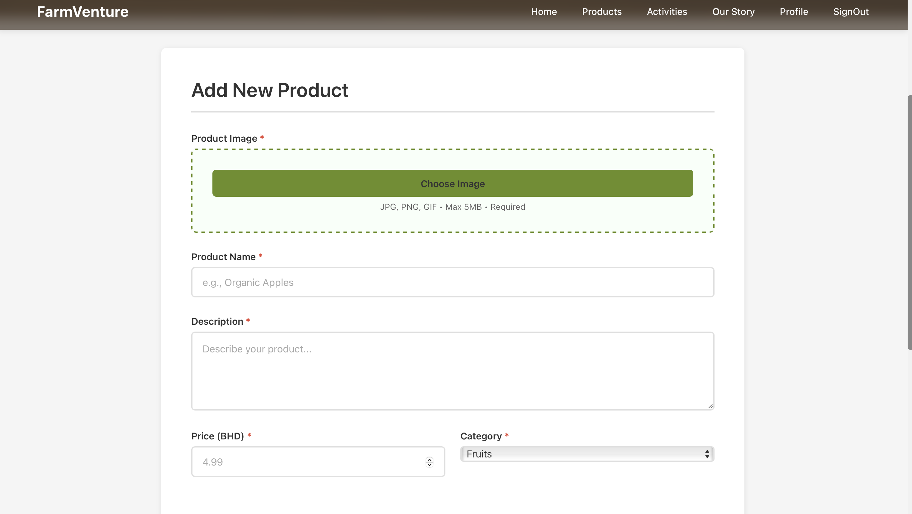

# FarmVenture-frontend

---

---
## Project Management

For detailed project tracking and task management, visit the deployment link, frontedn Repository and Trello board:

[Deployment Link](https://farm-venture-frontend.vercel.app)

[FarmVenture Trello Board](https://trello.com/invite/b/693d3bfe239dd3df41931a58/ATTIc38c998028aa2321ba37d4e9e801e2f72BA0136B/farmventure)

---

## Project Title: FarmVenture

## Discover -  Experience - Connect

FarmVenture is an agritourism platform designed to bridge local farms with experience-seeking visitors. This web application enables users to explore authentic farm products and seamlessly book hands-on agricultural activities, from seasonal harvest tours to sunrise farm visits and fruit-picking adventures.

---

## What FarmVenture Offers

 Browse Farm Products 
> View fresh, seasonal produce and farm goods available for in-person purchase during your visit.

 Book Farm Experiences 
> Reserve spots in guided farm tours, workshops, and seasonal events.

 Connect with Local Farms 
> Learn about farming practices, meet farmers, and support sustainable agriculture.

---

## Project Vision
FarmVenture was created to promote agritourism, help local farms gain visibility, and provide city dwellers with meaningful rural experiences; all within a single digital platform. Whether you're looking for a weekend workshop or fresh farm produce, FarmVenture makes the connection simple, reliable, and delightful.
Support local farms. Experience real agriculture.

---

## 🧪 Test Admin Account (For Marking Purposes)
Username: admin
Password: admin

---

## Attributions

- Images, and layout inspiration for this project were sourced from [Pinterest](https://www.pinterest.com/), focusing on visual appeal and modern UI.
- Icon library [Lucide React](https://lucide.dev/) 

> These assets are used for educational purposes and UI/UX inspiration only. All rights belong to the original creators.

---
## 🧪 Technologies Used

### Backend
- **Python** - Backend programming language
- **FastAPI** - Modern web framework for building APIs
- **PostgreSQL** - Relational database for data persistence
- **SQLAlchemy** - Python SQL toolkit and ORM for database operations
- **JWT (JSON Web Tokens)** - Authentication and authorization system

### Frontend
- **React** - Frontend library for building user interfaces
- **Vite** - Fast build tool and development server
- **React Router DOM** - Client-side routing for navigation
- **Context API** - Built-in React state management

### Services & Tools
- **Cloudinary** - Image and media management platform
- **CSS** - Styling and layout
---

## 🎯 Next Steps / Future Enhancements
- **Online Product Orders & Checkout** - Add a full shopping cart, checkout process, and order management system for users to purchase products online.
- **User Reviews & Ratings** - Allow customers to rate and review activities and products.
- **Email Notifications** - Send automated booking confirmations, order updates, and reminders.
